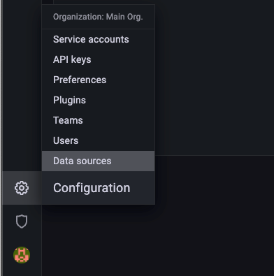
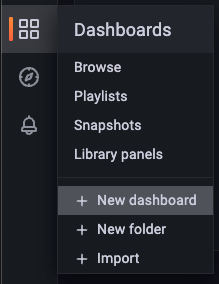
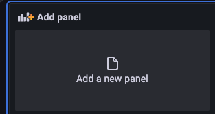
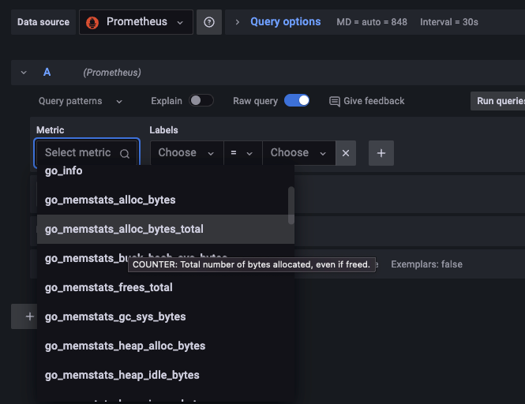
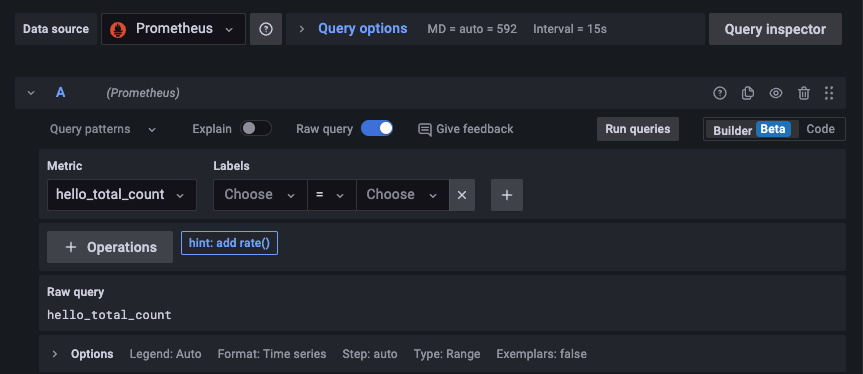
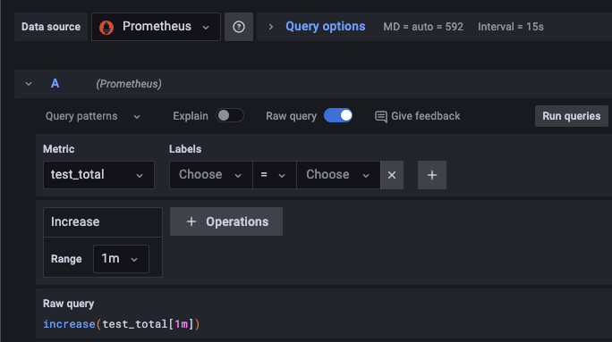

# How to build you own grafana
## Overview
In this project, will use grafana, prometheus, golang http server to build a simple metrics system. In http client, two 
collectors are created, `hello_total` and `test_total`.
## pre-requirements
>1. docker
>2. docker-compose
>3. prometheus
>4. golang
## How to use it
Open your terminal, and run the command
```shell
docker compose up
```
you can input url http://0.0.0.0:3000 in your browser. 


The default username and password both are `admin`



select prometheus as data source and input http://prometheus:9090 to the url. click `save & test`

add a new dashboard



add a new panel



then you can add any collector you want to add. In this project we add the collectors in our golang service to grafana. 



We can get the total number of `hello_total` called and QPS of `test_total`





Now you can input http://0.0.0.0:9999/hello or http://0.0.0.0:9999/test1 and see the change of metrics in the panel.